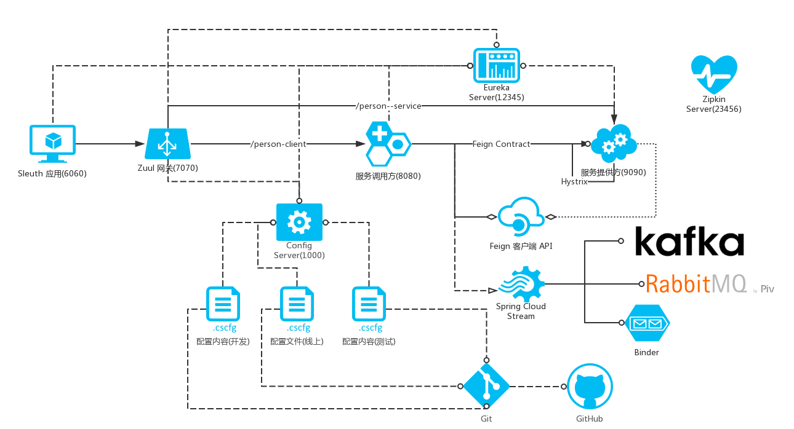

-----
ppt内容：
主要议题：
1、Spring Cloud Sleuth；
2、Zipkin 整合：HTTP收集，Spring Cloud Stream收集；
-----
# Spring Cloud Sleuth


## 基础

### [Google Dapper](dapper.pdf)


## Spring Cloud Sleuth 整合

### 引入Maven 依赖

```xml
<dependency>
	<groupId>org.springframework.cloud</groupId>
	<artifactId>spring-cloud-starter-sleuth</artifactId>
</dependency>
```


### 日志发生的变化

当应用ClassPath 下存在`org.springframework.cloud:spring-cloud-starter-sleuth`时候，日志会发生调整。

#### 整体流程

`spring-cloud-starter-sleuth` 会自动装配一个名为`TraceFilter` 组件（在 Spring WebMVC `DispatcherServlet `之前），它会增加一些 slf4j MDC

> [MDC](https://www.slf4j.org/manual.html#mdc) : Mapped Diagnostic Context

`org.springframework.cloud:spring-cloud-starter-sleuth` 会调整当前日志系统（slf4j）的 MDC `Slf4jSpanLogger#logContinuedSpan(Span)`:

```java
	@Override
	public void logContinuedSpan(Span span) {
		MDC.put(Span.SPAN_ID_NAME, Span.idToHex(span.getSpanId()));
		MDC.put(Span.TRACE_ID_NAME, span.traceIdString());
		MDC.put(Span.SPAN_EXPORT_NAME, String.valueOf(span.isExportable()));
		setParentIdIfPresent(span);
		log("Continued span: {}", span);
	}
```


## [Zipkin](zipkin.io) 整合

### 创建 Spring Cloud Zipkin 服务器

#### 增加 Maven 依赖

```xml
<!-- Zipkin 服务器依赖 -->
<dependency>
	<groupId>io.zipkin.java</groupId>
	<artifactId>zipkin-server</artifactId>
</dependency>

<!-- Zipkin 服务器UI控制器 -->
<dependency>
	<groupId>io.zipkin.java</groupId>
	<artifactId>zipkin-autoconfigure-ui</artifactId>
	<scope>runtime</scope>
</dependency>
```


#### 激活 Zipkin 服务器

```java
package com.gupao.springcloudzipkinserverdemo;

import org.springframework.boot.SpringApplication;
import org.springframework.boot.autoconfigure.SpringBootApplication;
import zipkin.server.EnableZipkinServer;

@SpringBootApplication
@EnableZipkinServer
public class SpringCloudZipkinServerDemoApplication {

	public static void main(String[] args) {
		SpringApplication.run(SpringCloudZipkinServerDemoApplication.class, args);
	}
}
```


### HTTP 收集（HTTP 调用）


### 简单整合`spring-cloud-sleuth`

#### 增加 Maven 依赖

```xml
<!-- Zipkin 客户端依赖-->
<dependency>
	<groupId>org.springframework.cloud</groupId>
	<artifactId>spring-cloud-starter-zipkin</artifactId>
</dependency>
```


#### Spring Cloud 服务大整合




>  端口信息
>
> > [spring-cloud-zuul](spring-cloud-zuul-demo) 端口：**7070**
> >
> > [person-client](spring-cloud-feign-demo/person-client) 端口：**8080**
> >
> > [person-service](spring-cloud-feign-demo/person-service-provider) 端口：**9090**
> >
> > [Eureka Server](spring-cloud-eureka-server-demo) 端口：**12345**
> >
> > [Zipkin Server](spring-cloud-zipkin-server-demo) 端口：**23456**


##### 启动服务

1. **Zipkin Server** 

2. **Eureka Server**

3. **spring-cloud-config-server**

4. **person-service** 

5. **person-client**

6. **spring-cloud-zuul**

   ​

##### spring-cloud-sleuth-demo 改造

###### 增加 Eureka 客户端依赖


```xml
<dependency>
	<groupId>org.springframework.cloud</groupId>
	<artifactId>spring-cloud-starter-eureka</artifactId>
</dependency>
```


###### 激活 Eureka 客户端

```java
package com.gupao.springcloudsleuthdemo;

import org.springframework.boot.SpringApplication;
import org.springframework.boot.autoconfigure.SpringBootApplication;
import org.springframework.cloud.client.discovery.EnableDiscoveryClient;

@SpringBootApplication
@EnableDiscoveryClient
public class SpringCloudSleuthDemoApplication {

	public static void main(String[] args) {
		SpringApplication.run(SpringCloudSleuthDemoApplication.class, args);
	}
}
```


###### 调整配置

```properties
spring.application.name = spring-cloud-sleuth

## 服务端口
server.port = 6060

## Zipkin 服务器配置
zipkin.server.host = localhost
zipkin.server.port = 23456

## 增加 ZipKin 服务器地址
spring.zipkin.base-url = \
  http://${zipkin.server.host}:${zipkin.server.port}/

## Eureka Server 服务 URL,用于客户端注册
eureka.client.serviceUrl.defaultZone=\
  http://localhost:12345/eureka
```


###### 调整代码连接 `spring-cloud-zuul`

```java
    /**
     * 完整的调用链路：
     * spring-cloud-sleuth
     * -> spring-cloud-zuul
     * -> person-client
     * -> person-service
     *
     * @return
     */
    @GetMapping("/to/zuul/person-client/person/find/all")
    public Object toZuul() {
        logger.info("spring-cloud-sleuth#toZuul()");
        // spring-cloud-zuul :  7070
        String url = "http://spring-cloud-zuul/person-client/person/find/all";
        return restTemplate.getForObject(
                url, Object.class);
    }
```


##### `spring-cloud-zuul` 上报到 Zipkin 服务器

##### `person-client` 上报到 Zipkin 服务器

##### `person-service` 上报到 Zipkin 服务器

```xml
<!-- Zipkin 客户端依赖-->
<dependency>
	<groupId>org.springframework.cloud</groupId>
	<artifactId>spring-cloud-starter-zipkin</artifactId>
</dependency>
```

```properties
## Zipkin 服务器配置
zipkin.server.host = localhost
zipkin.server.port = 23456

## 增加 ZipKin 服务器地址
spring.zipkin.base-url = \
  http://${zipkin.server.host}:${zipkin.server.port}/
```


### Spring Cloud Stream 收集（消息）


#### 调整`spring-cloud-zipkin-server` 通过 Stream 来收集

##### 增加 Maven 依赖

```xml
<!-- Zipkin 服务器通过Stream 收集跟踪信息 -->
<dependency>
	<groupId>org.springframework.cloud</groupId>
	<artifactId>spring-cloud-sleuth-zipkin-stream</artifactId>
</dependency>
<!-- 使用 Kafka 作为 Stream 服务器 -->
<dependency>
	<groupId>org.springframework.cloud</groupId>
	<artifactId>spring-cloud-stream-binder-kafka</artifactId>
</dependency>
```


##### 激活 Zipkin Stream

```java
package com.gupao.springcloudzipkinserverdemo;

import org.springframework.boot.SpringApplication;
import org.springframework.boot.autoconfigure.SpringBootApplication;
import org.springframework.cloud.sleuth.zipkin.stream.EnableZipkinStreamServer;
import zipkin.server.EnableZipkinServer;

@SpringBootApplication
//@EnableZipkinServer
@EnableZipkinStreamServer
public class SpringCloudZipkinServerDemoApplication {

	public static void main(String[] args) {
		SpringApplication.run(SpringCloudZipkinServerDemoApplication.class, args);
	}
}
```


##### 启动 Zookeeper

##### 启动 Kafka 服务器

##### 启动`spring-cloud-zipkin-server`


#### 调整 `spring-cloud-zuul`

##### 增加依赖

```xml
<!-- 添加 sleuth Stream 收集方式 -->
<dependency>
	<groupId>org.springframework.cloud</groupId>
	<artifactId>spring-cloud-sleuth-stream</artifactId>
</dependency>
<dependency>
	<groupId>org.springframework.cloud</groupId>
	<artifactId>spring-cloud-starter-sleuth</artifactId>
</dependency>
<!-- Kafka Binder -->
<dependency>
	<groupId>org.springframework.cloud</groupId>
	<artifactId>spring-cloud-stream-binder-kafka</artifactId>
</dependency>
```

> 注意把前面 HTTP 上报URL配置注释：
>
> ```properties
> ### 增加 ZipKin 服务器地址
> #spring.zipkin.base-url = \
> #  http://${zipkin.server.host}:${zipkin.server.port}/
> ```


## 问答部分

* 只有第一个被访问的应用的pom引用了spring-cloud-starter-sleuth包么？后面的应用spanid是怎么生成的？上报是汇集到一起上报么?

  答：每个应用都需要依赖`spring-cloud-starter-sleuth`。SpanId 是当前应用生成的，Trace ID 是有上个应用传递过来（Spring Cloud 通过请求头Headers）

* sleuth配合zipkin主要解决的是分布式系统下的请求的链路跟踪，这么理解没错吧？

  答：可以这么理解，问题排查、性能、调用链路跟踪

* sleuth 与 eureka 没关联吧？

  答：没有直接关系，Sleuth 可以利用 Eureka 做服务发现

* 生产上类sleuth的log日志应该看哪些资料？opentsdb，也有调用链路等相关信息么？

  答：OpenTsdb 主要是存储 JSON 格式，存放Metrics 信息

* 排查问题是根据traceid来查找有所日志吧

  答：可以通过TraceId 查找调用链路，通过 Span Id 定位在什么环节

* 整合显示是sleuth做的，zipkin用来收集信息对吧？

  答：zipkin 是一种用整合方式

* 问个题外话，两个系统对接需要通过json进行数据传输，但是两个系统之间的json数据格式是不同的，有没有好一点的开源项目可以解决这个问题，类似xslt转换xml的方式。

  答：A -> B, data1 ,  B -> A data2， 接受方使用Map。JSON Path

  ```json
  {"id":1,
  	abc:{
  		"name":"xiaomage",
        	 "age":32
  	}
  }
  ```

  ​

  ​


